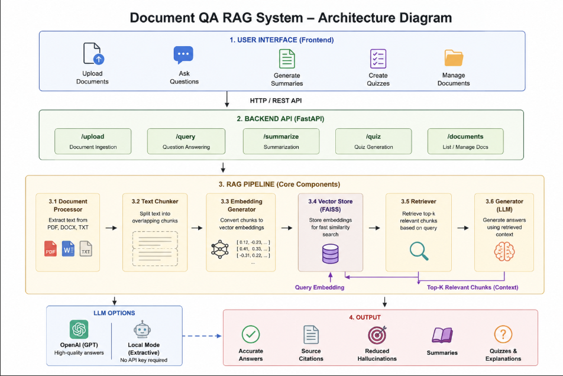

# 📄 Document QA RAG System

<div align="center">

[](https://www.python.org/)
[](https://fastapi.tiangolo.com/)
[](https://opensource.org/licenses/MIT)

### 🧠 AI-Powered Document Question Answering with Retrieval-Augmented Generation (RAG)

</div>

---

## 🎯 Overview

The **Document QA RAG System** allows you to upload documents (PDF, DOCX, TXT) and ask natural language questions about their content. Using **Retrieval-Augmented Generation (RAG)** technology, it provides accurate, context-grounded answers with source citations.

---

## ✨ Features

| Feature | Description | Status |
|---------|-------------|--------|
| **📤 Multi-Format Upload** | PDF, DOCX, TXT support | ✅ |
| **💬 Intelligent Q&A** | Natural language questions | ✅ |
| **📝 Document Summarization** | Concise/Detailed/Bullet points | ✅ |
| **🎯 Quiz Generation** | MCQ & True/False questions | ✅ |
| **📚 Source Citations** | Document & confidence scores | ✅ |

---

## 📸 Screenshots

### 1. Upload Interface


### 2. Q&A Interface


### 3. Answer with Sources


### 4. Summary Generation


### 5. Quiz Feature


### 6. Document Management


### 7. Quiz Results


---

### 🏗️ System Architecture



*Figure 1: Document QA RAG System Architecture*

### Data Flow

1. **Document Upload** → Text Extraction → Chunking → Embeddings → Vector Store
2. **User Query** → Query Embedding → Similarity Search → Retrieved Chunks
3. **Context + Query** → LLM → Generated Answer + Sources

---

## 🚀 Quick Start

### Prerequisites

- Python 3.10 or higher
- pip package manager

### Setup

```bash
# Clone repository
git clone https://github.com/BushraTayyab/document-qa-rag-system.git
cd document-qa-rag-system

# Backend setup
cd backend
python -m venv venv

# Activate virtual environment
# Windows:
venv\Scripts\activate
# Mac/Linux:
source venv/bin/activate

# Install dependencies
pip install -r requirements.txt

# Run backend
python main.py

Start the Frontend (in a new terminal)
cd frontend
python -m http.server 3000

Open Your Browser
Go to: http://localhost:3000
You should see the Document QA System interface

📦 Installation Details
Environment Configuration
Create .env file in backend/ folder:

# OpenAI (Optional)
OPENAI_API_KEY=your_api_key_here
USE_OPENAI=False

# Server
HOST=0.0.0.0
PORT=8000

# Processing
CHUNK_SIZE=500
CHUNK_OVERLAP=50
TOP_K_RETRIEVAL=5

📦Required Packages
fastapi==0.104.1
uvicorn==0.24.0
python-multipart==0.0.6
python-dotenv==1.0.0
pypdf==3.17.4
python-docx==1.1.0
sentence-transformers==2.2.2
faiss-cpu
openai==1.6.1
numpy==1.24.3
```

## 💻 Usage Guide

| # | Feature | How to Use |
|---|---------|------------|
| 1 | 📤 Upload | Click "Upload" → Drag & drop files (.txt, .pdf, .docx) |
| 2 | 💬 Q&A | Go to "Q&A" → Type question → Press Enter |
| 3 | 📝 Summary | Go to "Summary" → Choose style → Click Generate |
| 4 | 🎯 Quiz | Go to "Quiz" → Set Qty/Difficulty → Generate → Submit |

---

**Quick Start:** Upload a document → Ask questions → Get answers with sources! 🚀
